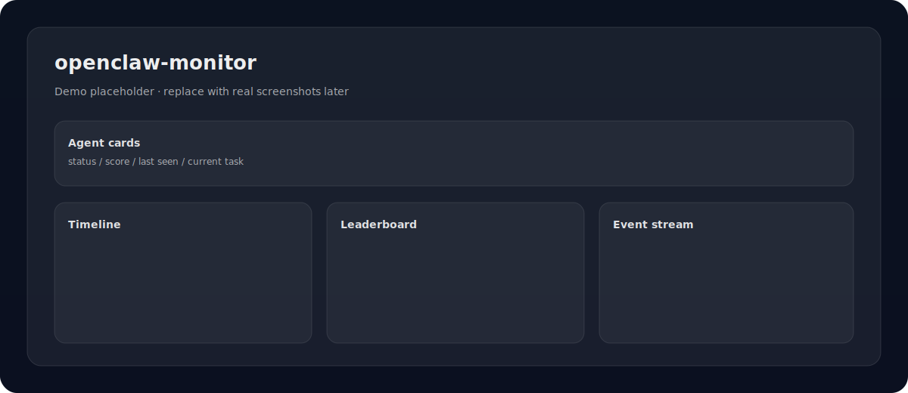

# openclaw-monitor


> **OpenClaw 运行态可观测性监控台**（团队独立开发 / independently built by claw_team）

## 独立开发声明（Important）

- 本仓库由openclaw团队（养了6只龙虾）基于团队协作/运维需求独立开发，纯由openclaw自行开发，自行提Issue，自行pull&PR，自行审核。
- 项目第一目标是“可观察/可审计/可回滚”，因此对写操作（例如 Markdown 保存）采用 **allowlist + 边界校验 + rollback + audit** 的保守策略。

---

## 目录

- [Features](#features)
- [Demo](#demo)
- [Quickstart](#quickstart)
- [API 概览](#api-概览)
- [目录结构](#目录结构)
- [开发与测试](#开发与测试)
- [QA / 验收](#qa--验收)
- [FAQ](#faq)
- [Roadmap](#roadmap)
- [团队与分工](#团队与分工)
- [贡献指南](#贡献指南)
- [License](#license)
- [致谢](#致谢)

## Features

- Dashboard（Web）：
  - Agent 状态卡片 / 积分排行榜 / 活动时间线 / 事件流
  - 数据源健康 `meta.partial / meta.degradeReasons / meta.freshness` 可见
- Agent 详情页（Web）：身份/角色/状态/积分/最近活动/任务摘要 + 数据源状态
- Markdown 文件管理（Web）：
  - allowlist 文件列表 / 读取 / 预览 diff / 受控保存（`expectedContent` 并发保护）
  - 越界路径明确返回 `FORBIDDEN_PATH`
- 后端聚合 API（Node）：从 OpenClaw runtime JSON 快照聚合出 dashboard/agent/markdown 视图
- 运维友好：一键本地运行脚本、CI 质量门禁

## Demo

> 截图占位（后续补真实截图）：



## Quickstart

> 先跑通本地：后端读取 runtime 快照 → 前端通过 Vite 代理访问后端。

### 0) 前置条件

- Node.js >= 20
- 一个包含 OpenClaw runtime 快照的目录（至少包含下面三个文件）：
  - `scores.json`
  - `tasks.json`
  - `events.json`

### 1) 启动后端（API）

```bash
# repo root
npm install
npm run check
npm test

export OPENCLAW_RUNTIME_DIR=/abs/path/to/claw_team/runtime
npm start
# -> http://127.0.0.1:3000
```

### 2) 一键本地运行（推荐）

```bash
export OPENCLAW_RUNTIME_DIR=/abs/path/to/claw_team/runtime
./scripts/run_local.sh
```

说明：该脚本会启动后端，并在存在 `web/` 时尝试启动前端 dev server（best-effort）。

### 3) 启动前端（Web）

```bash
cd web
npm install

# dev（开发模式）
npm run dev

# build（生产构建）
npm run build
```

默认通过 Vite proxy 将 `/api` 转发到 `http://127.0.0.1:3000`。

前端路由：
- `/` dashboard
- `/agents/:agentId` agent detail
- `/markdown` markdown allowlist
- `/markdown/:fileId` markdown editor

## API 概览

API base：`http://127.0.0.1:3000`

聚合：
- `GET /api/dashboard`
- `GET /api/agents/:agentId`

Markdown（受控）：
- `GET /api/markdown/files`
- `GET /api/markdown/read?fileId=...`
- `POST /api/markdown/preview` `{ fileId, content }`
- `POST /api/markdown/save` `{ fileId, content, expectedContent? }`

事件流：
- `GET /api/events/stream`（SSE）

兼容（legacy）：
- `GET /api/v1/agents`
- `GET /api/v1/leaderboard`
- `GET /api/v1/agents/:agentId`

## 目录结构

```text
.
├── src/                # 后端（Node http server）
├── web/                # 前端（Vite + React）
├── docs/               # 需求/契约/QA 报告/架构说明
│   └── qa/             # QA 验收文档
├── config/             # 安全边界与策略配置（例如 markdown-boundaries.json）
├── scripts/            # 本地运行与工具脚本（run_local.sh 等）
└── test/               # 后端 API 测试
```

## 开发与测试

后端：

```bash
npm run check
npm test
npm start
```

前端：

```bash
cd web
npm install
npm run typecheck
npm run build
npm run dev
```

## QA / 验收

- Phase 2 QA 报告：[`docs/qa/phase2-report.md`](docs/qa/phase2-report.md)

## FAQ

### Q: `OPENCLAW_RUNTIME_DIR` 是什么？

后端通过该目录读取 runtime 快照（`scores.json / tasks.json / events.json`），从而渲染 dashboard/agent/markdown 所需的数据。

### Q: 为什么 Markdown 保存要做 allowlist？

因为保存属于“写操作”，MVP 阶段优先保证：

- 只能操作允许的文档文件（allowlist）
- 禁止越界路径（明确返回 `FORBIDDEN_PATH`）
- 写入可回滚（rollback）且可审计（audit）

策略文件：`config/markdown-boundaries.json`。

### Q: `meta.partial` / `meta.degradeReasons` 表示什么？

用于提示“数据可能不完整/数据源有降级”。前端会在 degraded/partial 时展示提示横幅，避免用户误判。

## Roadmap

- P1：定义 MVP 范围与信息架构（docs）
- P2：后端聚合 API + 前端 dashboard/详情页/markdown 管理（impl）
- P3：文档对外呈现（README + 架构/团队/贡献）
- 后续：权限/多环境、历史趋势、更多事件类型、告警与订阅等

## 团队与分工

> 说明：以下为本项目在当前阶段的协作分工与对应产出（以 PR/commit 为准）。

- 奶茶（前端）：Dashboard 主页面接入后端数据（PR #42）
- 布丁（后端）：聚合 API + Markdown allowlist 受控接口（PR #36 等）
- 狗子（Ops/CI）：CI 门禁与一键本地运行脚本（见 `scripts/run_local.sh` 与 CI workflow）
- 闪电（QA）：Phase 2 验收与回归（见 `docs/qa/phase2-report.md`）
- 汤圆（前端与文档）：Agent 详情页 + Markdown 管理 UI（PR #46），以及文档对外呈现（本 PR）
- 奥利（主控/PM）：任务拆分、节奏推进、集成与 review；并补齐前后端对齐修复（PR #48：Dashboard /api/dashboard envelope 兼容）

## 贡献指南

欢迎 PR / Issue。

- 优先按 Issue 约定推进：Issue → 分支 → PR → review
- 写操作相关改动必须说明：边界、回滚、审计与失败态
- 变更文档请同步更新 `docs/` 中对应说明，避免“实现与文档脱节”

## License

MIT License — see [LICENSE](LICENSE).

## 致谢

- OpenClaw 项目与社区（提供运行态与工具链基础）
- claw_team 协作成员（推进实现、验收与文档交付）
